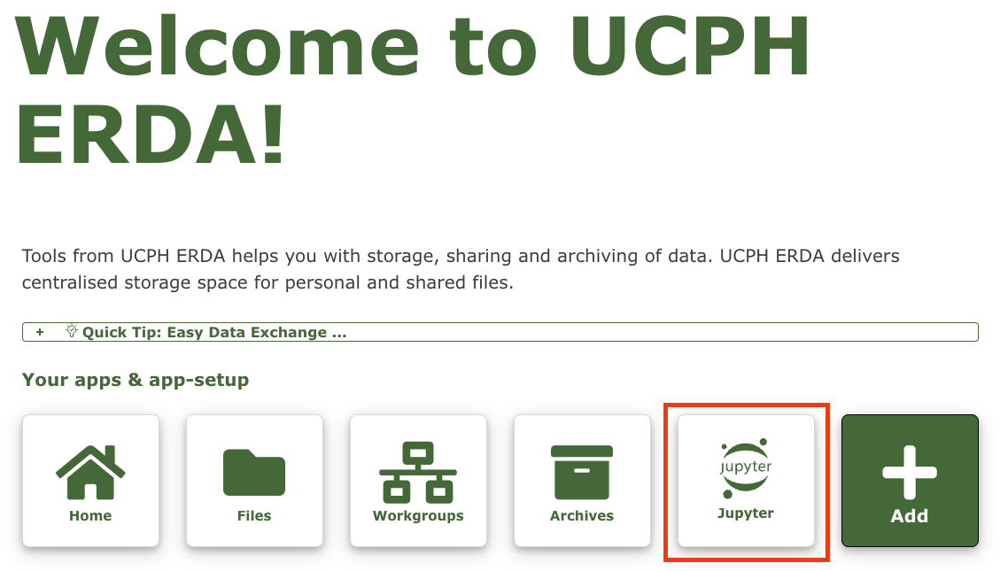
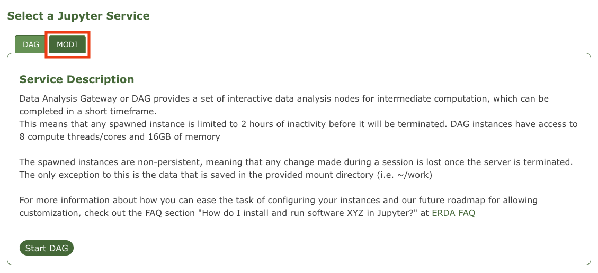
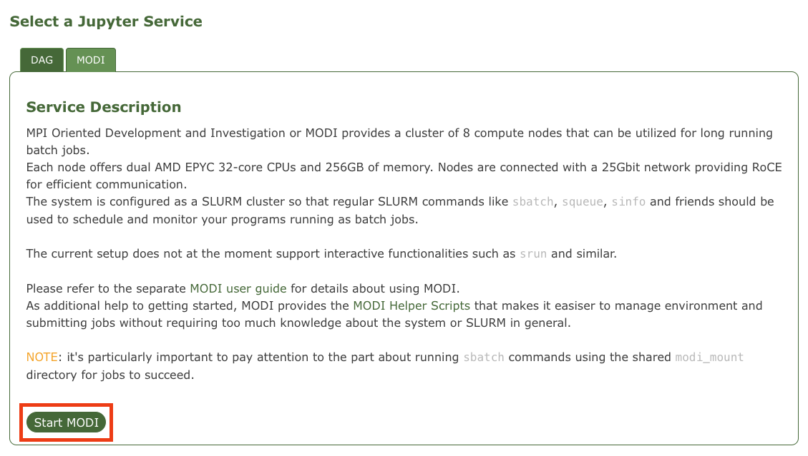
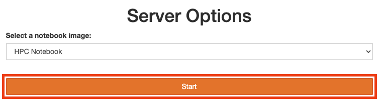
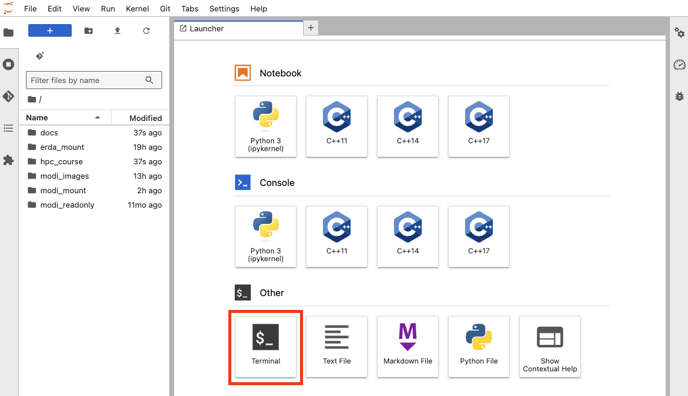

# MODI

## What is MODI?

The **MPI Oriented Development and Investigation** (MODI) cluster is a relative small HPC environment comprising 8 compute nodes, each with 32 cores (64 threads). Although it is small, it is rarely used, and has enough CPUs to significantly speed up large analyses through parallelization. **This repository contains basic guides and tutorials for getting set up on MODI and submitting batch jobs through the SLURM scheduling system**.

## How to sign up

As a UCPH employee or student, you should already be able to access the **Electronic Research Data Archive** (ERDA) service at https://erda.dk/, by clickng **log in**.

## How to access MODI

One logged in, you will be presented with the ERDA homepage. To access MODI, click the **Jupyter** button.

There are two services available, the **Data Analysis Gateway** (DAG) and **MODI**. Click the **MODI** tab.

On the MODI tab there is some information about the cluster, and a link to the official [MODI user guide](https://oidc.erda.dk/public/MODI-user-guide.pdf).

Click *Start MODI*.

You will be presented with several server options. The default **HPC Notebook** is what you want. Click *Start*.

On the next screen, click **Start My Server**.

This will open a JupyterLab interface with several options. The most important parts of this interface are the file explorer on the sidebar and the **Terminal** button in the launcher.

The file explorer lists the contents of your home directory on the server. To access the command line, click the **Terminal** button.

To get started, familiarize yourself with the [Basic Concepts](tutorials/00_basic_concepts) or check out one of the other [Tutorials](tutorials).