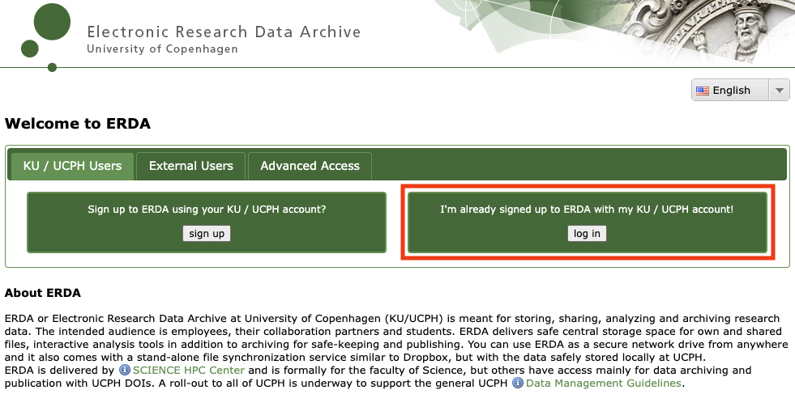

# MODI

## What is MODI?

The MPI Oriented Development and Investigation (MODI) cluster is a relative small HPC environment based comprising 8 compute nodes that can be used to parallelize computation.

## How to sign up

As a UCPH employee or student, you should already be able to access the Electronic Research Data Archive (ERDA) service at https://erda.dk/, by clickng **log in**.

